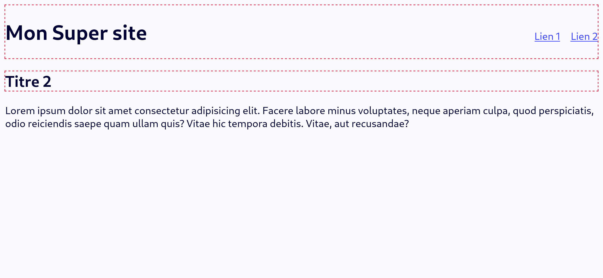
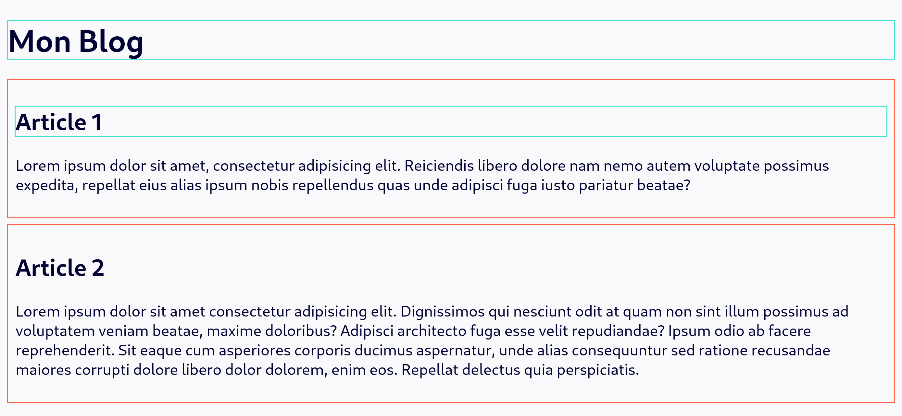
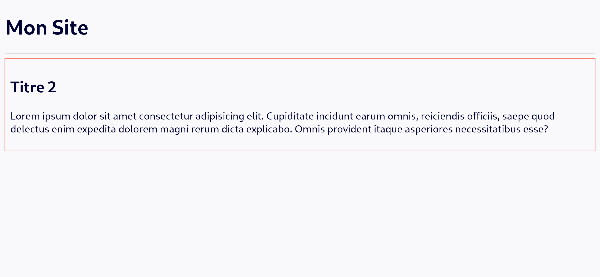
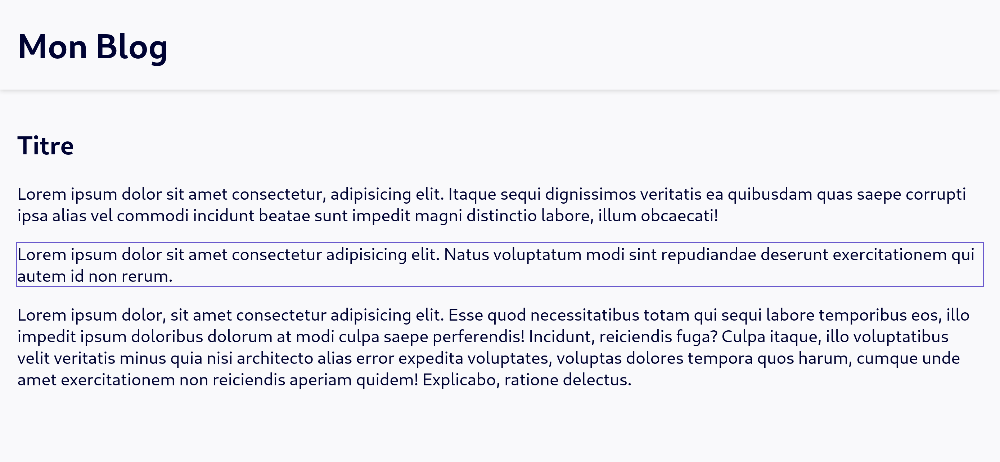
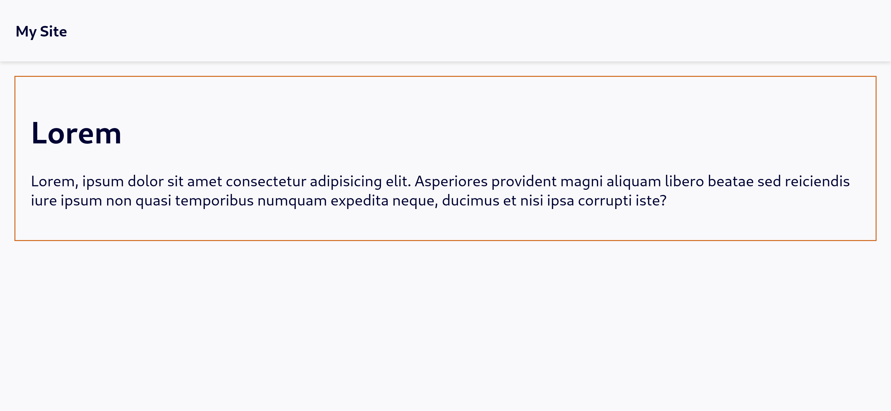
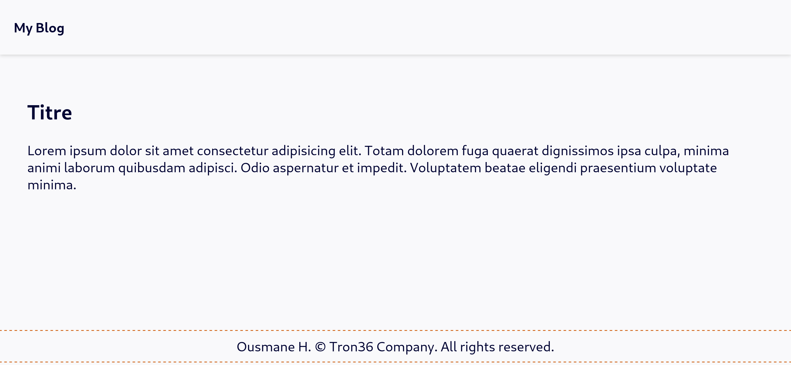
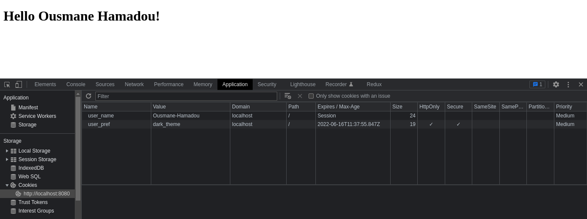
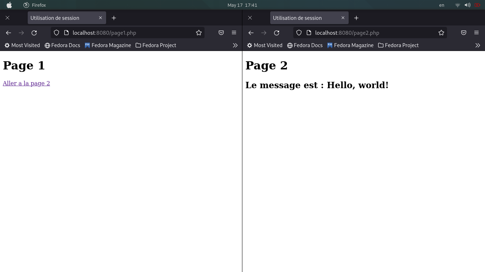

# [TPE] Programmation Web

Ousmane Hamadou - 17B292FS

[toc]

Le code complet est disponible sur github à l’adresse [https://github.com/ousmane-hamadou/travail-personnel-pw.git](https://github.com/ousmane-hamadou/travail-personnel-pw.git) organisé en fonction des thèmes.

## Les éléments de structuration de page HTML

HTML 5 a apporté beaucoup d'amélioration pour créer des applications plus puissantes (capacité de lire le contenu multimédia, un support pour le stockage local, un support pour géolocalisation, etc) mais HTML 5 introduit également beaucoup de nouveaux éléments sémantiques pour la structuration des pages que nous étudierons dans cette partie.

Il est important de noter que l'utilisation d'éléments structuration sémantique à la place des éléments comme `div`, `span`, etc fournit davantage d'informations sémantiques aux lecteurs d'écran, aux moteurs de recherche et aux applications tierces.

### Élément `header`

La balise HTML `header` spécifie l’en-tête d’un document, d’une section ou d’un article. L'élément `header` devrait être utilisé comme un conteneur pour  du contenu introductif ou généralement un groupe de contenu introductif, de contenu aidant à la navigation. Il peut également contenir des éléments  tels que des titres, un logo, formulaire de recherche.

**Exemple de code**

```html
<!DOCTYPE html>
<html lang="fr">
  <head>
    <meta charset="UTF-8" />
    <meta name="viewport" content="width=device-width, initial-scale=1.0" />
    <title>Element de structuration</title>

    <style>
      body {
        font-family: system-ui, sans-serif;
        background-color: #f6f6fb;
        color: #000333;
      }

      a {
        color: #3842ff;
      }

      body > header {
        display: flex;
        align-items: baseline;
        justify-content: space-between;
        /* border-bottom: 2px solid lightgrey; */
      }

      header {
        outline: 1px crimson dashed;
        /* padding: 8px; */
        /* margin: 8px; */
      }

      ul {
        list-style: none;
        padding: 0;
        margin: 0;
        display: flex;
        gap: 16px;
      }
    </style>
  </head>
  <body>
    <header>
      <h1>Mon Super site</h1>

      <nav>
        <ul>
          <li><a href="#">Lien 1</a></li>
          <li><a href="#">Lien 2</a></li>
        </ul>
      </nav>
    </header>

    <article>
      <header>
        <h2>Titre 2</h2>
      </header>
      <p>
        Lorem ipsum dolor sit amet consectetur adipisicing elit. Facere labore
        minus voluptates, neque aperiam culpa, quod perspiciatis, odio
        reiciendis saepe quam ullam quis? Vitae hic tempora debitis. Vitae, aut
        recusandae?
      </p>
    </article>
  </body>
</html>
```

**Sortie**



**Remarque** : cette balise ne s'affiche pas comme quelque chose de spécial dans un navigateur, vous devez utiliser CSS pour cela.

### Élément `article`

L'élément `article` défini un composant autonome d'une page qui consiste en une composition autonome dans un document, une page ou un site c'est-à-dire le contenu de la balise `article` est indépendant des autres contenus du site.

On peut citer comme exemples :

- un article de magazine ou de journal
- un article de blog
- un message sur le forum
- une fiche produit

**Exemple de code**

```html
<!DOCTYPE html>
<html>
  <head>
    <meta charset="UTF-8" />
    <meta name="viewport" content="width=device-width, initial-scale=1.0" />
    <title>Aritcle</title>

    <style>
      body {
        font-family: system-ui, sans-serif;
        background-color: #f6f6fb;
        color: #000333;
      }

      article {
        outline: 1px solid tomato;
        padding: 8px;
        margin-top: 8px;
      }

      header {
        outline: 1px solid turquoise;
      }
    </style>
  </head>
  <body>
    <header>
      <h1>Mon Blog</h1>
    </header>

    <main>
      <article>
        <header>
          <h2>Article 1</h2>
        </header>
        <p>
          Lorem ipsum dolor sit amet, consectetur adipisicing elit. Reiciendis
          libero dolore nam nemo autem voluptate possimus expedita, repellat
          eius alias ipsum nobis repellendus quas unde adipisci fuga iusto
          pariatur beatae?
        </p>
      </article>

      <article>
        <h2>Article 2</h2>

        <p>
          Lorem ipsum dolor sit amet consectetur adipisicing elit. Dignissimos
          qui nesciunt odit at quam non sint illum possimus ad voluptatem veniam
          beatae, maxime doloribus? Adipisci architecto fuga esse velit
          repudiandae? Ipsum odio ab facere reprehenderit. Sit eaque cum
          asperiores corporis ducimus aspernatur, unde alias consequuntur sed
          ratione recusandae maiores corrupti dolore libero dolor dolorem, enim
          eos. Repellat delectus quia perspiciatis.
        </p>
      </article>
    </main>
  </body>
</html>
```

**Sortie**



**Remarque** :

- Comme `header`, `article` ne s'affiche pas comme quelque chose de spécial dans un navigateur.
- Les zones d’article zone en rouge alors les zone `cyan` représentent des `header`

### Élément `nav`

L’élément `nav` forme le bloc principal fait pour créer des zone conséquents contenants des liens de navigations  vers d'autres pages ou des fragments de cette page. On utilise principalement pour contenir des menus, des tables des matières, des index, etc.

**Exemple de code**

```html
<!DOCTYPE html>
<html>
  <head>
    <meta charset="UTF-8" />
    <meta name="viewport" content="width=device-width, initial-scale=1.0" />
    <title>Nav</title>
    <style>
      body {
        font-family: system-ui, sans-serif;
        background-color: #f6f6fb;
        color: #000333;
        margin: 0;
      }

      a {
        color: #3842ff;
      }

      header {
        box-shadow: 0px 1px 4px lightgray;
      }

      main {
        padding: 16px;
      }

      a {
        display: block;
        text-decoration: none;
        padding: 16px 18px;
      }

      ul {
        list-style: none;
        padding: 0;
        margin: 0;
        display: flex;
        gap: 16px;
      }
    </style>
  </head>
  <body>
    <header>
      <nav>
        <ul>
          <li><a href="#">Accueil</a></li>
          <li><a href="#">Aprops</a></li>
          <li><a href="#">Blog</a></li>
        </ul>
      </nav>
    </header>

    <main>
      <h1>Welcome!</h1>

      <p>
        Lorem ipsum dolor sit, amet consectetur adipisicing elit. Eveniet
        corrupti fugiat sint. Quaerat animi odit cupiditate molestias ipsam
        ratione, laudantium nihil suscipit, modi mollitia placeat harum
        recusandae? Quis, numquam natus.
      </p>
    </main>
  </body>
</html>
```

**Sortie**


### Élément `section`

L’élément `section` est utilisé pour regrouper le contenu thématique. L'élément `section` ne doit pas être utilisé comme un conteneur générique à la place de l’élément `div`, notamment lorsque le sectionnement du contenu sert uniquement la mise en forme.

**Exemple de code**

```html
<!DOCTYPE html>
<html>
  <head>
    <meta charset="UTF-8" />
    <meta name="viewport" content="width=device-width, initial-scale=1.0" />
    <title>Section</title>
    <style>
      body {
        font-family: system-ui, sans-serif;
        background-color: #f6f6fb;
        color: #000333;
      }
        
      header {
        border-bottom: 1px solid lightgrey;
      }

      section {
        outline: 1px solid salmon;
        padding: 8px;
        margin-top: 8px;
      }
    </style>
  </head>
  <body>
    <header>
      <h1>Mon Site</h1>
    </header>

    <section>
      <h2>Titre 2</h2>

      <p>
        Lorem ipsum dolor sit amet consectetur adipisicing elit. Cupiditate
        incidunt earum omnis, reiciendis officiis, saepe quod delectus enim
        expedita dolorem magni rerum dicta explicabo. Omnis provident itaque
        asperiores necessitatibus esse?
      </p>
    </section>
  </body>
</html>
```

**Sortie**



**Remarque** : `section` non plus ne s'affiche pas comme quelque chose de spécial dans un navigateur.

### Élément `aside`

L’élément `aside` définit une section contenant des informations complémentaires au département principal c'est-a-dire une partie d'un document dont le contenu n'a qu'un rapport indirect avec le contenu principal du document.

**Exemple de code**

```html
<!DOCTYPE html>
<html>
  <head>
    <meta charset="UTF-8" />
    <meta name="viewport" content="width=device-width, initial-scale=1.0" />
    <title>Aside</title>
    <style>
      body {
        font-family: system-ui, sans-serif;
        background-color: #f9f9fb;
        color: #000333;
        margin: 0;
      }

      h1 {
        margin: 0;
        padding: 22px 16px;
      }
      header {
        box-shadow: 0px 1px 4px lightgray;
      }

      main {
        padding: 16px;
      }

      aside {
        outline: 1px solid slateblue;
      }
    </style>
  </head>
  <body>
    <header>
      <h1>Mon Blog</h1>
    </header>

    <main>
      <article>
        <h2>Titre</h2>
        <p>
          Lorem ipsum dolor sit amet consectetur, adipisicing elit. Itaque sequi
          dignissimos veritatis ea quibusdam quas saepe corrupti ipsa alias vel
          commodi incidunt beatae sunt impedit magni distinctio labore, illum
          obcaecati!
        </p>

        <aside>
          <p>
            Lorem ipsum dolor sit amet consectetur adipisicing elit. Natus
            voluptatum modi sint repudiandae deserunt exercitationem qui autem
            id non rerum.
          </p>
        </aside>

        <p>
          Lorem ipsum dolor, sit amet consectetur adipisicing elit. Esse quod
          necessitatibus totam qui sequi labore temporibus eos, illo impedit
          ipsum doloribus dolorum at modi culpa saepe perferendis! Incidunt,
          reiciendis fuga? Culpa itaque, illo voluptatibus velit veritatis minus
          quia nisi architecto alias error expedita voluptates, voluptas dolores
          tempora quos harum, cumque unde amet exercitationem non reiciendis
          aperiam quidem! Explicabo, ratione delectus.
        </p>
      </article>
    </main>
  </body>
</html>
```

**Sortie**



Dans cet exemple, on utilise `aside` afin de baliser un paragraphe d'un article qui n'est pas directement lié au contenu principal de l'article et c'est pour cela qu'on utilise cet élément.

### Élément `main`

Déjà utiliser dans les exemples précédents, l’élément `main` forme le contenu principal du document placé à l’intérieur de `body`.  Le contenu principal de la zone est constitué de contenu directement en relation, ou qui étend le sujet principal du document ou de la fonctionnalité principale d'une application.

Un document ne peut pas avoir plus d'un seul élément `main`

**Exemple de code**

```html
<!DOCTYPE html>
<html>
  <head>
    <meta charset="UTF-8" />
    <meta name="viewport" content="width=device-width, initial-scale=1.0" />
    <title>Main</title>
    <style>
      body {
        font-family: system-ui, sans-serif;
        background-color: #f9f9fb;
        color: #000333;
        margin: 0;
      }

      header > p {
        margin: 0;
        padding: 22px 16px;
        font-weight: bold;
      }

      header {
        box-shadow: 0px 1px 4px lightgray;
      }

      main {
        padding: 16px;
        outline: 1px solid chocolate;
        margin: 16px;
      }
    </style>
  </head>
  <body>
    <header>
      <p>My Site</p>
    </header>

    <main>
      <h1>Lorem</h1>

      <p>
        Lorem, ipsum dolor sit amet consectetur adipisicing elit. Asperiores
        provident magni aliquam libero beatae sed reiciendis iure ipsum non
        quasi temporibus numquam expedita neque, ducimus et nisi ipsa corrupti
        iste?
      </p>
    </main>
  </body>
</html>
```

**Sortie**



**Remarque** : Le contenu de la balise doit être unique et ne pas dupliquer les mêmes blocs que ceux répétés dans d'autres documents, tels que l'en-tête du site, le pied de page, le menu, le formulaire de recherche, les informations de copyright, etc.

### Élément `footer`

L'élément `footer` forme le pied de la section ou de l'élément racine dans lequel il se trouve. Un élément `footer` contient habituellement des informations sur l'autrice ou l'auteur de la section, les données relatives au droit d'auteur (*copyright*) ou les liens vers d'autres documents en relation.

**Exemple de code**

```html
<!DOCTYPE html>
<html>
  <head>
    <meta charset="UTF-8" />
    <meta http-equiv="X-UA-Compatible" content="IE=edge" />
    <meta name="viewport" content="width=device-width, initial-scale=1.0" />
    <title>Footer</title>
    <style>
      body {
        min-height: 100vh;
        display: flex;
        flex-direction: column;
        font-family: system-ui, sans-serif;
        background-color: #f9f9fb;
        color: #000333;
        margin: 0;
      }

      header > p {
        margin: 0;
        padding: 22px 16px;
        font-weight: bold;
      }

      header {
        box-shadow: 0px 1px 4px lightgray;
      }

      main {
        padding: 16px;
        margin: 16px;
        flex-grow: 1;
      }

      footer p {
        text-align: center;
        padding: 8px;
        margin: 0;
      }

      footer {
        margin-bottom: 4px;
        outline: 1px dashed chocolate;
      }
    </style>
  </head>
  <body>
    <header>
      <p>My Blog</p>
    </header>

    <main>
      <article>
        <h1>Titre</h1>

        <p>
          Lorem ipsum dolor sit amet consectetur adipisicing elit. Totam dolorem
          fuga quaerat dignissimos ipsa culpa, minima animi laborum quibusdam
          adipisci. Odio aspernatur et impedit. Voluptatem beatae eligendi
          praesentium voluptate minima.
        </p>
      </article>
    </main>

    <footer>
      <p>Ousmane H. © Tron36 Company. All rights reserved.</p>
    </footer>
  </body>
</html>
```

**Sortie**



## Dates et Heures en PHP
PHP offre de nombreux fonctions pour manipuler les dates et heures, Il existe près de cinquante fonctions de date et d'heure. Nous allons les réduire à certaines d'entre elles qui sont très importantes pour nous.

### Fonction `date()`

La fonction date() formate un horodatage pour qu'il ait un sens, par exemple 16h58 jeudi 17 mai 2022. La fonction `date()` accepte deux arguments, selon la syntaxe suivante : `date(format, timestamp)`.

**Exemple de code**

```php
// affiche le jour en fonction de votre local
echo date("l") . PHP_EOL;

// affiche le jour au format, date, mois, annee, heure, AM ou PM
echo date("l jS \of F Y h:i:s A");
?>
```

**Console**

```
Tuesday
Tuesday 17th of May 2022 09:20:41 AM
```

PHP fournit plus de trente-cinq caractères sensibles à la casse qui sont utilisés pour formater la date et l'heure. En voici quelques une :

|         | Caractères           | Description                                                  | Exemple                   |
| ------- | -------------------- | ------------------------------------------------------------ | ------------------------- |
| Jour    | j                    | Jour du mois, pas de zéros en tête                           | 1-31                      |
| Jour    | d                    | Jour du mois, 2 chiffres, zéros en tête                      | 01-31                     |
| Jour    | D                    | Jour de la semaine, 3 premières lettres                      | Mon – Sun                 |
| Jour    | l ("minuscule de L") | Jour de la semaine                                           | Sunday – Saturday         |
| Jour    | N                    | Jour numérique de la semaine                                 | 1 (Monday) – 7 (Sunday)   |
| Jour    | w                    | Jour numérique de la semaine                                 | 0 (Sunday) – 6 (Saturday) |
| Jour    | z                    | Jour de l'année                                              | 0-365                     |
| Semaine | O                    | Semaine numérique de l'année (les semaines commencent le lundi) | 1-52                      |
| Mois    | M                    | Représentation textuelle d'un mois, trois lettres            | Jan – Dec                 |
| Mois    | F                    | Représentation textuelle complète d'un mois                  | January – December        |
| Mois    | m                    | Mois numérique, avec des zéros non significatifs             | 01-12                     |
| Mois    | n                    | Mois numérique, sans zéros non significatifs                 | 1-12                      |
| Mois    | t                    | Nombre de jours dans le mois donné                           | 28-31                     |
| Année   | Y                    | Représentation numérique d'une année, 4 chiffres             | 2000,1999                 |
| Année   | y                    | Représentation à 2 chiffres d'une année                      | 99,97, etc.               |
| Temps   | a                    | Minuscule Ante Meridiem & Post Meridiem                      | am, pm                    |
| Temps   | A                    | Majuscule Ante Meridiem & Post Meridiem                      | AM, PM                    |
| Temps   | g                    | Format 12 heures sans zéros non significatifs                | 1-12                      |
| Temps   | G                    | Format 24 heures sans zéros en tête                          | 00-23                     |
| Temps   | h                    | Format 12 heures avec des zéros non significatifs            | 01-12                     |
| Temps   | H                    | Format 24 heures avec des zéros non significatifs            | 00-23                     |
| Temps   | i                    | Minutes avec des zéros non significatifs                     | 00-59                     |
| Temps   | s                    | Secondes avec des zéros non significatifs                    | 00-59                     |

En utilisant une combinaison de ces caractères et virgules, points, tirets, points-virgules et barres obliques inverses, vous pouvez désormais formater les dates et les heures au format de votre choix.

**Exemple de code**

```php
<?php
  echo date("g:i A l, F d, Y");

  $yesterday = strtotime("yesterday");
  echo date("Y-m-d", $yesterday);
?>
```

**Console**

```
9:44 AM Tuesday, May 17, 2022
2022-05-16
```

### Fonction `time()`

La fonction `time()` renvoie l'horodatage actuel. La fonction `time()` peut également renvoyer un horodatage modifié. Vous pouvez ajouter ou soustraire n'importe quel nombre de secondes à la fonction afin de renvoyer l'horodatage d'une date et d'une heure précédentes ou à venir.

Par exemple, pour renvoyer un horodatage pour la semaine prochaine ou pour renvoyer un horodatage de la semaine dernière, je peux ajouter ou soustraire 7 jours en déterminant le nombre de secondes impliquées (7 jours * 24 heures par jour * 60 minutes dans une heure * 60 secondes dans une heure = nombre de secondes dans 7 jours).

**Exemple de code**

```php
  $last_week = time() - (7 * 24 * 60 * 60);
  $next_week = time() + (7 * 24 * 60 * 60);
  $next_month = time() + (30 * 24 * 60 * 60);

  echo 'La Semaine dernière: ' . $last_week . PHP_EOL;
  echo 'Semaine prochaine: ' . $next_week . PHP_EOL;
  echo 'Mois prochain: ' . $next_month . PHP_EOL;
```

**Console**

```
La Semaine dernière: 1652176735
La Semaine prochaine: 1653386335
Le Mois prochain: 1655373596
```

### Fonction `strtotime()`

La fonction `strtotime()` accepte une description `datetime` en anglais et la transforme en horodatage. C'est un moyen simple de déterminer "la semaine prochaine" ou "lundi dernier" sans utiliser la fonction `time()` et un tas de maths.

**Exemple de code**

```php
<?php
  echo strtotime("now") . PHP_EOL;
  echo strtotime("tomorrow") . PHP_EOL;
  echo strtotime("yesterday") . PHP_EOL;
  echo strtotime("10 September 2000") . PHP_EOL;
  echo strtotime("+1 day") . PHP_EOL;
  echo strtotime("+1 week") . PHP_EOL;
  echo strtotime("+1 week 2 days 4 hours 2 seconds") . PHP_EOL;
?>
```

**Console**

```
1652781956
1652832000
1652659200
968544000
1652868356
1653386756
1653573958
```

### Fonction `localtime()`

La fonction `localtime()` renvoie un tableau contenant les composants horaires d'un horodatage Unix.

**Exemple de code**

```php
<?php
print_r(localtime());
echo PHP_EOL;
print_r(localtime(time(),true));
?>
```

**Console**

```
Array
(
    [0] => 12
    [1] => 8
    [2] => 10
    [3] => 17
    [4] => 4
    [5] => 122
    [6] => 2
    [7] => 136
    [8] => 0
)

Array
(
    [tm_sec] => 12
    [tm_min] => 8
    [tm_hour] => 10
    [tm_mday] => 17
    [tm_mon] => 4
    [tm_year] => 122
    [tm_wday] => 2
    [tm_yday] => 136
    [tm_isdst] => 0
)
```

## Utilisation des cookies en PHP

Un cookie est un petit ensembles de données envoyer par le serveur web au navigateur web de  vos visiteurs. Le navigateur peut alors le stocker localement, puis le renvoyer à la prochaine requête vers le même serveur.  Les cookies ont une durée de vie limitée (on pourra définir la date d’expiration d’un cookie)  et peuvent être à tout moment supprimer par vos visiteurs sur leur ordinateur.

Nous utilisons généralement les cookies pour trois principales raison : 

- Gestion des sessions : Logins, panier d'achat, score d'un jeu, ou tout autre chose dont le serveur doit se souvenir.
- Personnalisation : Préférences utilisateur, thèmes, et autres paramètres.
- Suivi : Enregistrement et analyse du comportement utilisateur.

En PHP, nous utilisons la fonction `setcookie()` pour créer les cookies. Cette fonction doit être appeler avant d’écrire tout code HTML pour qu’elle fonctionne puisque les cookies doivent être envoyés avant toute autre sortie.

**Syntaxe**

```php
setcookie(
    string $name,
    string $value = "",
    int $expires_or_options = 0,
    string $path = "",
    string $domain = "",
    bool $secure = false,
    bool $httponly = false
): bool
```


| Parametre              | Description                                                  |
| ---------------------- | ------------------------------------------------------------ |
| **name**               | Le nom du cookie. Le nom d’un cookie est soumis aux mêmes règles que les noms des variables. |
| **value**              | La valeur du cookie. Cette valeur est stockée sur l'ordinateur du client ; ne stockez pas d'informations importantes. Si le paramètre `name` vaut `'cookiename'`, cette valeur est récupéré avec `$_COOKIE['cookiename']`. |
| **expires_or_options** | La date d’expiration du cookie sous forme d’un timestamp UNIX, donc, ce sera un nombre de secondes depuis l'époque Unix (1 janvier 1970 GMT). En d'autres termes, vous devriez fixer cette valeur à l'aide de la fonction `time()`en y ajoutant le nombre de secondes après lequel on veut que le cookie expire. Si vous ne spécifiez pas ce paramètre ou s'il vaut 0, le cookie expirera à la fin de la session (lorsque le navigateur sera fermé). |
| **path**               | Le chemin sur le serveur sur lequel le cookie sera disponible. Si la valeur est `'/'`, le cookie sera disponible sur l'ensemble du domaine `domain`. Si la valeur est `'/foo/'`, le cookie sera uniquement disponible dans le répertoire `/foo/` ainsi que tous ses sous-répertoires comme `/foo/bar/` dans le domaine `domain`. La valeur par défaut est le répertoire courant où le cookie a été défini. |
| **domain**             | Indique le domaine ou le sous domaine pour lequel le cookie est disponible. Définir ceci à un sous-domaine (tel que `'www.example.com'`) rendra le cookie disponible pour ce sous-domaine ainsi que tous ses sous-domaines (par exemple : `w2.www.example.com`). |
| **secure**             | Indique si le cookie doit uniquement être transmis à travers une connexion sécurisée HTTPS depuis le client. Si la valeur passée est `true`, le cookie ne sera envoyé que si la connexion est sécurisée |
| **httponly**           | Indique si le cookie ne doit être accessible que par le protocole HTTP. Pour que le cookie ne soit accessible que par le protocole http, on indiquera la valeur `true`. Cela permet d’interdire l’accès au cookie aux langages de scripts comme le JavaScript par exemple, pour se protéger potentiellement d’une attaque de type XSS. |

Pour récupérer la valeur d’un cookie, nous allons utiliser la variable super globale `$_COOKIE`.

**Exemple de code**

```php+HTML
<?php
	// user_name  expirera à la fin de la session (lorsque le navigateur sera fermé).
    setcookie('user_name', 'Ousmane-Hamadou');
	// user_pref expirera apres 30 jours
    setcookie('user_pref', 'dark_theme', time()+3600*24*30, '/', '', true, true);
?>
<!DOCTYPE html>
<html>
    <head>
        <title>Utilisation de cookies</title>
        <meta charset="utf-8">
    </head>
    
    <body>
        <h1>Hello <?= isset($_COOKIE['user_name']) ? str_replace('-', ' ', $_COOKIE['user_name']) : '' ?>!</h1>
    </body>
</html>
```

**Résultat dans Google Chrome**



## Utilisation de session en PHP

Une session est un moyen de stocker des informations à utiliser sur plusieurs pages. Contrairement à un cookie, les informations ne sont pas stockées sur l'ordinateur de l'utilisateur mais sur le serveur. En général,  un identifiant de session est envoyé au navigateur via des cookies de session et sera utilisés pour récupérer les données existantes de la session.

Une session démarre dès que la fonction `session_start()` est appelée et se termine en général dès que la fenêtre courante du navigateur est fermée mais on peut également terminer la session de manière anticipée ou qu’un cookie de session avec une durée de vie plus longues ait été défini.

Pour pouvoir utiliser les variables de session, il va avant tout falloir qu’une session soit démarrée avec la fonction `session_start()`. Cette fonction va se charger de vérifier si une session a déjà été démarrée en recherchant la présence d’un identifiant de session et, si ce n’est pas le cas, va démarrer une nouvelle session et générer un identifiant de session unique pour un utilisateur.

La fonction `session_start()`  doit être appeler  avant toute autre opération dans nos pages, c’est-à-dire au début de celles-ci. Elle doit être également appeler dans chaque page où on souhaite pouvoir accéder aux variables de session.

**Exemple**

```php+HTML
<?php
// page1.php
session_start();

$_SESSION['message'] = 'Hello, world!';
?>

<!DOCTYPE html>
<html>
	<head>
        <title>Utilisation de cookies</title>
        <meta charset="utf-8">
	</head>
	<body>
        <h1>Page 1</h1>
        
        <a href="page2.php">Aller a la page 2</a>
	</body>
</html>
```

Après avoir vu la page `page1.php` avec un navigateur, la seconde page `page2.php` (dont le code suit) va magiquement afficher les données de session. 

```php+HTML
<?php session_start(); ?>

<!DOCTYPE html>
<html>
	<head>
        <title>Utilisation de cookies</title>
        <meta charset="utf-8">
	</head>
	<body>
        <h1>Page 2</h1>
        
        <h2>Le message est : <?= $_SESSION['message'] ?></h2>
	</body>
</html>
```

**Résultat**


