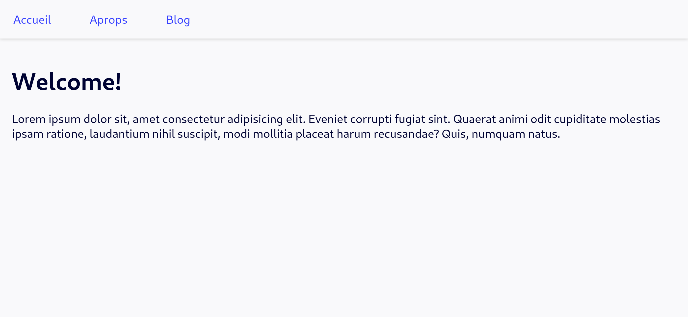

# [TPE] Programmation Web

Ousmane Hamadou - 17B292FS

[toc]

Le code complet est disponible sur github à l’adresse [https://github.com/ousmane-hamadou/travail-personnel-pw.git](https://github.com/ousmane-hamadou/travail-personnel-pw.git) organisé en fonction des thèmes.

## Les éléments de structuration de page HTML

HTML 5 a apporté beaucoup d'amélioration pour créer des applications plus puissantes (capacité de lire le contenu multimédia, un support pour le stockage local, un support pour géolocalisation, etc) mais HTML 5 introduit également beaucoup de nouveaux éléments sémantiques pour la structuration des pages que nous étudierons dans cette partie.

Il est important de noter que l'utilisation d'éléments structuration sémantique à la place des éléments comme `div`, `span`, etc fournit davantage d'informations sémantiques aux lecteurs d'écran, aux moteurs de recherche et aux applications tierces.

### Élément `header`

La balise HTML `header` spécifie l’en-tête d’un document, d’une section ou d’un article. L'élément `header` devrait être utilisé comme un conteneur pour  du contenu introductif ou généralement un groupe de contenu introductif, de contenu aidant à la navigation. Il peut également contenir des éléments  tels que des titres, un logo, formulaire de recherche.

Exemple

```html
<!DOCTYPE html>
<html lang="fr">
  <head>
    <meta charset="UTF-8" />
    <meta name="viewport" content="width=device-width, initial-scale=1.0" />
    <title>Element de structuration</title>

    <style>
      body {
        font-family: system-ui, sans-serif;
        background-color: #f6f6fb;
        color: #000333;
      }

      a {
        color: #3842ff;
      }

      body > header {
        display: flex;
        align-items: baseline;
        justify-content: space-between;
        /* border-bottom: 2px solid lightgrey; */
      }

      header {
        outline: 1px crimson dashed;
        /* padding: 8px; */
        /* margin: 8px; */
      }

      ul {
        list-style: none;
        padding: 0;
        margin: 0;
        display: flex;
        gap: 16px;
      }
    </style>
  </head>
  <body>
    <header>
      <h1>Mon Super site</h1>

      <nav>
        <ul>
          <li><a href="#">Lien 1</a></li>
          <li><a href="#">Lien 2</a></li>
        </ul>
      </nav>
    </header>

    <article>
      <header>
        <h2>Titre 2</h2>
      </header>
      <p>
        Lorem ipsum dolor sit amet consectetur adipisicing elit. Facere labore
        minus voluptates, neque aperiam culpa, quod perspiciatis, odio
        reiciendis saepe quam ullam quis? Vitae hic tempora debitis. Vitae, aut
        recusandae?
      </p>
    </article>
  </body>
</html>
```

Résultat


**Remarque** : cette balise ne s'affiche pas comme quelque chose de spécial dans un navigateur, vous devez utiliser CSS pour cela.

### Élément `article`

L'élément `article` défini un composant autonome d'une page qui consiste en une composition autonome dans un document, une page ou un site c'est-à-dire le contenu de la balise `article` est indépendant des autres contenus du site.

On peut citer comme exemples :

- un article de magazine ou de journal
- un article de blog
- un message sur le forum
- une fiche produit

Exemple

```html
<!DOCTYPE html>
<html>
  <head>
    <meta charset="UTF-8" />
    <meta name="viewport" content="width=device-width, initial-scale=1.0" />
    <title>Aritcle</title>

    <style>
      body {
        font-family: system-ui, sans-serif;
        background-color: #f6f6fb;
        color: #000333;
      }

      article {
        outline: 1px solid tomato;
        padding: 8px;
        margin-top: 8px;
      }

      header {
        outline: 1px solid turquoise;
      }
    </style>
  </head>
  <body>
    <header>
      <h1>Mon Blog</h1>
    </header>

    <main>
      <article>
        <header>
          <h2>Article 1</h2>
        </header>
        <p>
          Lorem ipsum dolor sit amet, consectetur adipisicing elit. Reiciendis
          libero dolore nam nemo autem voluptate possimus expedita, repellat
          eius alias ipsum nobis repellendus quas unde adipisci fuga iusto
          pariatur beatae?
        </p>
      </article>

      <article>
        <h2>Article 2</h2>

        <p>
          Lorem ipsum dolor sit amet consectetur adipisicing elit. Dignissimos
          qui nesciunt odit at quam non sint illum possimus ad voluptatem veniam
          beatae, maxime doloribus? Adipisci architecto fuga esse velit
          repudiandae? Ipsum odio ab facere reprehenderit. Sit eaque cum
          asperiores corporis ducimus aspernatur, unde alias consequuntur sed
          ratione recusandae maiores corrupti dolore libero dolor dolorem, enim
          eos. Repellat delectus quia perspiciatis.
        </p>
      </article>
    </main>
  </body>
</html>
```

Résultat


**Remarque** :

- Comme `header`, `article` ne s'affiche pas comme quelque chose de spécial dans un navigateur.
- Les zones d’article zone en rouge alors les zone `cyan` représentent des `header`

### Élément `nav`

L’élément `nav` forme le bloc principal fait pour créer des zone conséquents contenants des liens de navigations  vers d'autres pages ou des fragments de cette page. On utilise principalement pour contenir des menus, des tables des matières, des index, etc.

Exemple

```html
<!DOCTYPE html>
<html>
  <head>
    <meta charset="UTF-8" />
    <meta name="viewport" content="width=device-width, initial-scale=1.0" />
    <title>Nav</title>
    <style>
      body {
        font-family: system-ui, sans-serif;
        background-color: #f6f6fb;
        color: #000333;
        margin: 0;
      }

      a {
        color: #3842ff;
      }

      header {
        box-shadow: 0px 1px 4px lightgray;
      }

      main {
        padding: 16px;
      }

      a {
        display: block;
        text-decoration: none;
        padding: 16px 18px;
      }

      ul {
        list-style: none;
        padding: 0;
        margin: 0;
        display: flex;
        gap: 16px;
      }
    </style>
  </head>
  <body>
    <header>
      <nav>
        <ul>
          <li><a href="#">Accueil</a></li>
          <li><a href="#">Aprops</a></li>
          <li><a href="#">Blog</a></li>
        </ul>
      </nav>
    </header>

    <main>
      <h1>Welcome!</h1>

      <p>
        Lorem ipsum dolor sit, amet consectetur adipisicing elit. Eveniet
        corrupti fugiat sint. Quaerat animi odit cupiditate molestias ipsam
        ratione, laudantium nihil suscipit, modi mollitia placeat harum
        recusandae? Quis, numquam natus.
      </p>
    </main>
  </body>
</html>
```

Résultat



### Élément `section`

L’élément `section` est utilisé pour regrouper le contenu thématique. L'élément `section` ne doit pas être utilisé comme un conteneur générique à la place de l’élément `div`, notamment lorsque le sectionnement du contenu sert uniquement la mise en forme.

Exemple

```html
<!DOCTYPE html>
<html>
  <head>
    <meta charset="UTF-8" />
    <meta name="viewport" content="width=device-width, initial-scale=1.0" />
    <title>Section</title>
    <style>
      body {
        font-family: system-ui, sans-serif;
        background-color: #f6f6fb;
        color: #000333;
      }
        
      header {
        border-bottom: 1px solid lightgrey;
      }

      section {
        outline: 1px solid salmon;
        padding: 8px;
        margin-top: 8px;
      }
    </style>
  </head>
  <body>
    <header>
      <h1>Mon Site</h1>
    </header>

    <section>
      <h2>Titre 2</h2>

      <p>
        Lorem ipsum dolor sit amet consectetur adipisicing elit. Cupiditate
        incidunt earum omnis, reiciendis officiis, saepe quod delectus enim
        expedita dolorem magni rerum dicta explicabo. Omnis provident itaque
        asperiores necessitatibus esse?
      </p>
    </section>
  </body>
</html>
```

Résultat


**Remarque** : `section` non plus ne s'affiche pas comme quelque chose de spécial dans un navigateur.

### Élément `aside`

L’élément `aside` définit une section contenant des informations complémentaires au département principal c'est-a-dire une partie d'un document dont le contenu n'a qu'un rapport indirect avec le contenu principal du document.

Exemple

```html
<!DOCTYPE html>
<html>
  <head>
    <meta charset="UTF-8" />
    <meta name="viewport" content="width=device-width, initial-scale=1.0" />
    <title>Aside</title>
    <style>
      body {
        font-family: system-ui, sans-serif;
        background-color: #f9f9fb;
        color: #000333;
        margin: 0;
      }

      h1 {
        margin: 0;
        padding: 22px 16px;
      }
      header {
        box-shadow: 0px 1px 4px lightgray;
      }

      main {
        padding: 16px;
      }

      aside {
        outline: 1px solid slateblue;
      }
    </style>
  </head>
  <body>
    <header>
      <h1>Mon Blog</h1>
    </header>

    <main>
      <article>
        <h2>Titre</h2>
        <p>
          Lorem ipsum dolor sit amet consectetur, adipisicing elit. Itaque sequi
          dignissimos veritatis ea quibusdam quas saepe corrupti ipsa alias vel
          commodi incidunt beatae sunt impedit magni distinctio labore, illum
          obcaecati!
        </p>

        <aside>
          <p>
            Lorem ipsum dolor sit amet consectetur adipisicing elit. Natus
            voluptatum modi sint repudiandae deserunt exercitationem qui autem
            id non rerum.
          </p>
        </aside>

        <p>
          Lorem ipsum dolor, sit amet consectetur adipisicing elit. Esse quod
          necessitatibus totam qui sequi labore temporibus eos, illo impedit
          ipsum doloribus dolorum at modi culpa saepe perferendis! Incidunt,
          reiciendis fuga? Culpa itaque, illo voluptatibus velit veritatis minus
          quia nisi architecto alias error expedita voluptates, voluptas dolores
          tempora quos harum, cumque unde amet exercitationem non reiciendis
          aperiam quidem! Explicabo, ratione delectus.
        </p>
      </article>
    </main>
  </body>
</html>
```

Résultat


Dans cet exemple, on utilise `aside` afin de baliser un paragraphe d'un article qui n'est pas directement lié au contenu principal de l'article et c'est pour cela qu'on utilise cet élément.

### Élément `main`

Déjà utiliser dans les exemples précédents, l’élément `main` forme le contenu principal du document placé à l’intérieur de `body`.  Le contenu principal de la zone est constitué de contenu directement en relation, ou qui étend le sujet principal du document ou de la fonctionnalité principale d'une application.

Un document ne peut pas avoir plus d'un seul élément `main`

Exemple

```html
<!DOCTYPE html>
<html>
  <head>
    <meta charset="UTF-8" />
    <meta name="viewport" content="width=device-width, initial-scale=1.0" />
    <title>Main</title>
    <style>
      body {
        font-family: system-ui, sans-serif;
        background-color: #f9f9fb;
        color: #000333;
        margin: 0;
      }

      header > p {
        margin: 0;
        padding: 22px 16px;
        font-weight: bold;
      }

      header {
        box-shadow: 0px 1px 4px lightgray;
      }

      main {
        padding: 16px;
        outline: 1px solid chocolate;
        margin: 16px;
      }
    </style>
  </head>
  <body>
    <header>
      <p>My Site</p>
    </header>

    <main>
      <h1>Lorem</h1>

      <p>
        Lorem, ipsum dolor sit amet consectetur adipisicing elit. Asperiores
        provident magni aliquam libero beatae sed reiciendis iure ipsum non
        quasi temporibus numquam expedita neque, ducimus et nisi ipsa corrupti
        iste?
      </p>
    </main>
  </body>
</html>
```

Resultat


**Remarque** : Le contenu de la balise doit être unique et ne pas dupliquer les mêmes blocs que ceux répétés dans d'autres documents, tels que l'en-tête du site, le pied de page, le menu, le formulaire de recherche, les informations de copyright, etc.

### Élément `footer`

L'élément `footer` forme le pied de la section ou de l'élément racine dans lequel il se trouve. Un élément `footer` contient habituellement des informations sur l'autrice ou l'auteur de la section, les données relatives au droit d'auteur (*copyright*) ou les liens vers d'autres documents en relation.

Exemple

```html
<!DOCTYPE html>
<html>
  <head>
    <meta charset="UTF-8" />
    <meta http-equiv="X-UA-Compatible" content="IE=edge" />
    <meta name="viewport" content="width=device-width, initial-scale=1.0" />
    <title>Footer</title>
    <style>
      body {
        min-height: 100vh;
        display: flex;
        flex-direction: column;
        font-family: system-ui, sans-serif;
        background-color: #f9f9fb;
        color: #000333;
        margin: 0;
      }

      header > p {
        margin: 0;
        padding: 22px 16px;
        font-weight: bold;
      }

      header {
        box-shadow: 0px 1px 4px lightgray;
      }

      main {
        padding: 16px;
        margin: 16px;
        flex-grow: 1;
      }

      footer p {
        text-align: center;
        padding: 8px;
        margin: 0;
      }

      footer {
        margin-bottom: 4px;
        outline: 1px dashed chocolate;
      }
    </style>
  </head>
  <body>
    <header>
      <p>My Blog</p>
    </header>

    <main>
      <article>
        <h1>Titre</h1>

        <p>
          Lorem ipsum dolor sit amet consectetur adipisicing elit. Totam dolorem
          fuga quaerat dignissimos ipsa culpa, minima animi laborum quibusdam
          adipisci. Odio aspernatur et impedit. Voluptatem beatae eligendi
          praesentium voluptate minima.
        </p>
      </article>
    </main>

    <footer>
      <p>Ousmane H. © Tron36 Company. All rights reserved.</p>
    </footer>
  </body>
</html>
```

Résultat


